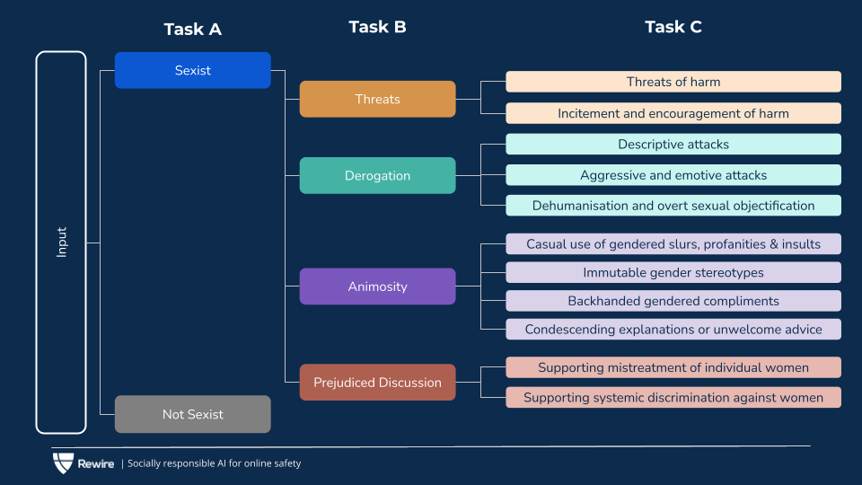
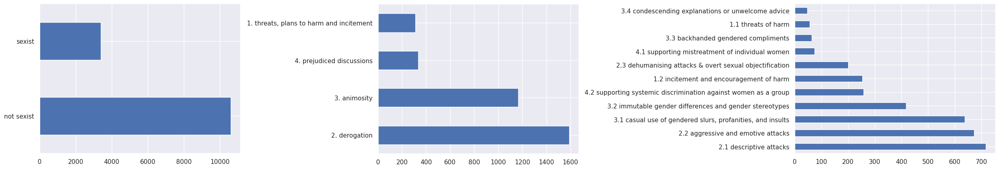
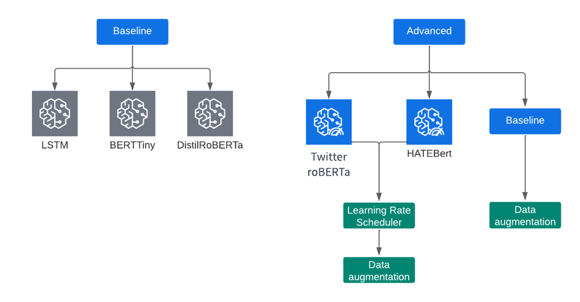
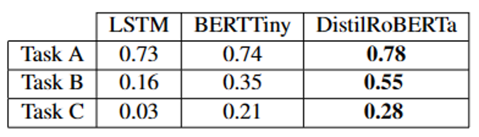
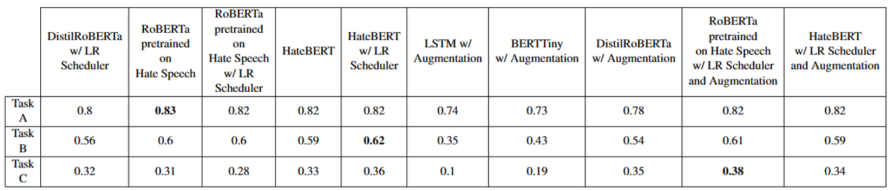

# Sexist Detection in Sentences
 The project focuses on identifying signs of sexism in texts through three tasks: identifying sexism, categorizing sexism, and sub-categorizing sexism. The best model used for completing these tasks is RoBERTa pre-trained on hate speech with the addition of data augmentation and learning rate scheduler techniques.

The project was done in collaboration with [Daniele Marini](https://github.com/DANIELEMARINI99) and [Iulian Zorila](https://github.com/iulianzorila) and is part of the **Natural Language Processing exam-related project**.

 

 # Introduction
 Sexism is a type of discrimination based on gender that can lead to violence and oppression, and identifying sexist texts through a deep learning model could lead to more inclusive and respectful environments. In this study, the authors used a dataset from [SemEval-2023 Task 10](https://arxiv.org/abs/2303.04222) to perform a text classification task using deep learning techniques, including applying various techniques to improve model performance and comparing and evaluating the best-performing model.
 
 

# Dataset Informations
The SemEval competition dataset included **three classification tasks** related to the detection of online sexism:
- The first task requires a **binary classification** of whether a post is sexist or not
- The second task involves a **four-class classification** of sexist posts into different categories. 
- The third task is an **11-class classification** of fine-grained vectors of sexism for posts that are identified as sexist.

The dataset used in the competition has around 14,000 labeled sentences but exhibits a significant data imbalance.

 

 # System Description
For each task we divided our work in Baseline Phase and an Advanced Phase:
- The **Baseline Phase** involved the use of simple models to evaluate which models work best for the given task
- The **Advanced Phase** used advanced techniques to further improve the results. Techniques used in the Advanced Phase include larger models, different optimizers, pretrained models on a similar topic, data augmentation techniques, learning rate schedulers, and combinations of successful techniques.

 

## Advanced Techniques
We attempted various techniques to improve the performance of their models, including using **larger models**, **different optimizers**, **pre-trained models**, **data augmentation techniques**, **learning rate schedulers**, and **combining successful techniques**.

## Data Augmentation
We used **Contextual Word Embeddings augmentation** with BERT and RoBERTa models to generate similar words based on the context to increase their training set. We faced difficulties with the informal language and slang terms in the dataset. We set the augmentation probability to 0.3 and skipped certain words from the process and found that insertion works better than substitution in preserving the semantic meaning of the sentence.

# Results
The following table represent the result obtain using the baseline models.

The following table represent the result obtain using all the other models combined with different techniques.

## Task A
- **DistilRoBERTa** achieved an accuracy of 83% and F1 score of 0.78 as the **best baseline model** for binary classification task A.
- Using **RoBERTa pre-trained on a hate speech** dataset led to the **best results**, with an accuracy of 87.81% and F1 score of 0.83.
- The **LSTM model also performed decently** despite limited capacity.
- The **model struggles with rare slang** and may misclassify sexist phrases that don't contain offensive terms as non-sexist.
- The model has a higher chance of classifying sexist samples as non-sexist due to the **unbalanced dataset problem**.

## Task B
- Task B had **lower performance than Task A** due to increased difficulty
- **DistilRoBERTa** was the best-performing **baseline model** with accuracy of 57.56% and F1 score of 0.55
- **hateBERT, a model trained on hate speech dataset, performed best in Task B with One Cycle learning rate scheduling technique**, achieving accuracy of 65.23% and F1 score of 0.62
- **Larger models showed substantial difference in performance compared to smaller models** in Task B, highlighting the importance of using larger models for more complex tasks
- **Regularization techniques were more effective** in Task B as they helped models to better generalize and increase metric scores
- **"Derogation" class was predicted most often due to it being the majority class** in Task B dataset
- **"Prejudiced discussions" had the highest degree of misclassification** (F1 score of 0.35) likely due to few samples in the dataset
- Task B had a relatively low number of sentences in the test set, which may result in **inaccuracies in the final results**

## Task C
- **Hardest problem** with 11 classes of sexism and heavy data imbalance
- **Best-performing baseline** model was **DistilRoBERTa** with F1 score of 0.28 and accuracy of 46.37%
- Best model was **RoBERTa pretrained on hate speech with OneCycle learning scheduler and data augmentation**, achieving F1 score of 0.38 and accuracy of 48.02%
- **Worst performing classes were "condescending explanations or unwelcome advice" and "supporting mistreatment of individual women"**
- **Model overly predicts certain subclasses due to data imbalance**
- Low number of samples in test set makes **evaluation approximate and inaccurate**

# Final Discussion
Overall we can assert the following statement:

- The dataset has blurred boundaries between some sentences and it's **difficult to distinguish between classes in tasks B and C**.
- **Smaller models performed well in binary classification** but not in more complex tasks, highlighting the importance of using complex models for challenging tasks.
- **Regularization techniques**, particularly LR scheduling, **had a more significant impact on performance as the complexity of the task increased**.
- Changing **optimizer or loss function had minimal effect on model performance** in this experimental setup.
- **Data augmentation** improved results slightly overall, but **worked best in task C for a specific model** (RoBERTa pretrained on hate speech with learning rate scheduler).

